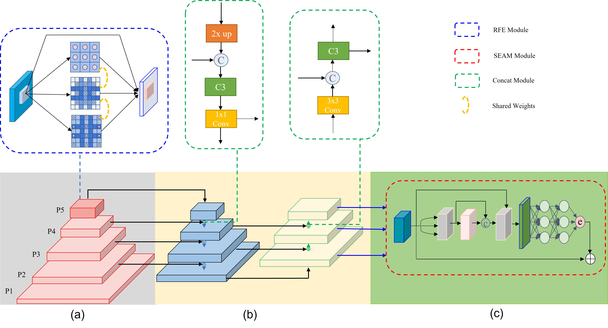

# YOLO-FaceV2

### Introduction
YOLO-FaceV2: A Scale and Occlusion Aware Face Detector     
*[https://arxiv.org/abs/2208.02019](https://arxiv.org/abs/2208.02019)*    


### Framework Structure


### Requirments
Create a Python Virtual Environment.   
```shell
conda create -n {name} python=x.x
```

Enter Python Virtual Environment.   
```shell
conda activate {name}
```

Install pytorch in *[this](https://pytorch.org/get-started/previous-versions/)*.  
```shell 
pip install torch==1.10.0+cu111 torchvision==0.11.0+cu111 torchaudio==0.10.0 -f https://download.pytorch.org/whl/torch_stable.html
```

Install other python package.   
```shell
pip install -r requirements.txt
```
   
### Step-Through Example
#### Downloaded Dataset
```shell
bash data/scripts/get_widerface.sh
```

#### Dataset
```shell
python3 data/convert.py
python3 data/voc_label.py
```

### Preweight
Wait for a few days...

#### Training
```shell
python train.py --weights preweight.pt    
                --data data/WIDER_FACE.yaml    
                --cfg models/yolov5s_v2_RFEM_MultiSEAM.yaml     
                --batch-size 32   
                --epochs 250
```

#### Evaluate   
```shell
python widerface_pred.py --weights runs/train/x/weights/best.pt     
                         --save_folder ./widerface_evaluate/widerface_txt_x    
cd widerface_evaluate/    
python evaluation.py --pred ./widerface_txt_x
```

### Finetune
see in *[https://github.com/ultralytics/yolov5/issues/607](https://github.com/ultralytics/yolov5/issues/607)*
```shell
# Single-GPU
python train.py --epochs 10 --data coco128.yaml --weights yolov5s.pt --cache --evolve

# Multi-GPU
for i in 0 1 2 3 4 5 6 7; do
  sleep $(expr 30 \* $i) &&  # 30-second delay (optional)
  echo 'Starting GPU '$i'...' &&
  nohup python train.py --epochs 10 --data coco128.yaml --weights yolov5s.pt --cache --device $i --evolve > evolve_gpu_$i.log &
done

# Multi-GPU bash-while (not recommended)
for i in 0 1 2 3 4 5 6 7; do
  sleep $(expr 30 \* $i) &&  # 30-second delay (optional)
  echo 'Starting GPU '$i'...' &&
  "$(while true; do nohup python train.py... --device $i --evolve 1 > evolve_gpu_$i.log; done)" &
done
```

### Reference
*[https://github.com/ultralytics/yolov5](https://github.com/ultralytics/yolov5)*    
*[https://github.com/deepcam-cn/yolov5-face](https://github.com/deepcam-cn/yolov5-face)*   
*[https://github.com/open-mmlab/mmdetection](https://github.com/open-mmlab/mmdetection)*   
*[https://github.com/dongdonghy/repulsion_loss_pytorch](https://github.com/dongdonghy/repulsion_loss_pytorch)*   