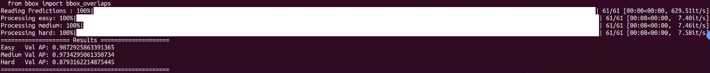
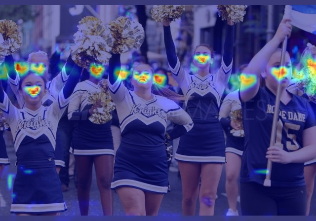

# YOLO-FaceV2

## Introduction
YOLO-FaceV2: A Scale and Occlusion Aware Face Detector    
*[https://arxiv.org/abs/2208.02019](https://arxiv.org/abs/2208.02019)*  

## Framework Structure


## Environment Requirments
Create a Python Virtual Environment.   
```shell
conda create -n {name} python=x.x
```

Enter Python Virtual Environment.   
```shell
conda activate {name}
```

Install pytorch in *[this](https://pytorch.org/get-started/previous-versions/)*.  
```shell 
pip install torch==1.10.0+cu111 torchvision==0.11.0+cu111 torchaudio==0.10.0 -f https://download.pytorch.org/whl/torch_stable.html
```

Install other python package.   
```shell
pip install -r requirements.txt
```

## Step-Through Example
### Installation
Get the code.    
```shell
git clone https://github.com/Krasjet-Yu/YOLO-FaceV2.git
```

### Dataset
Download the [WIDER FACE](http://shuoyang1213.me/WIDERFACE/) dataset. Then convert it to YOLO format.
```shell
# You can modify convert.py and voc_label.py if needed.
python3 data/convert.py
python3 data/voc_label.py
```

## Preweight
The link is [yolo-facev2s.pt](https://github.com/Krasjet-Yu/YOLO-FaceV2/releases/download/v1.0/preweight.pt)


### Training
Train your model on WIDER FACE.
```shell
python train.py --weights preweight.pt    
                --data data/WIDER_FACE.yaml    
                --cfg models/yolov5s_v2_RFEM_MultiSEAM.yaml     
                --batch-size 32   
                --epochs 250
```

### Test
```shell
python detect.py --weights ./preweight/best.pt --source ./data/images/test.jpg --plot-label --view-img
```

### Evaluate    

Evaluate the trained model via next code on WIDER FACE   
        
If you don't want to train, you can also directly use our trained model to evaluate.   

The link is [yolo-facev2_last.pt](https://github.com/Krasjet-Yu/YOLO-FaceV2/releases/download/v1.0/best.pt)     


```shell
python widerface_pred.py --weights runs/train/x/weights/best.pt     
                         --save_folder ./widerface_evaluate/widerface_txt_x    
cd widerface_evaluate/    
python evaluation.py --pred ./widerface_txt_x
```
Download the *[eval_tool](http://shuoyang1213.me/WIDERFACE/support/eval_script/eval_tools.zip)* to show the performance.    
    
The result is shown below:    




## Finetune
see in *[https://github.com/ultralytics/yolov5/issues/607](https://github.com/ultralytics/yolov5/issues/607)*
```shell
# Single-GPU
python train.py --epochs 10 --data coco128.yaml --weights yolov5s.pt --cache --evolve

# Multi-GPU
for i in 0 1 2 3 4 5 6 7; do
  sleep $(expr 30 \* $i) &&  # 30-second delay (optional)
  echo 'Starting GPU '$i'...' &&
  nohup python train.py --epochs 10 --data coco128.yaml --weights yolov5s.pt --cache --device $i --evolve > evolve_gpu_$i.log &
done

# Multi-GPU bash-while (not recommended)
for i in 0 1 2 3 4 5 6 7; do
  sleep $(expr 30 \* $i) &&  # 30-second delay (optional)
  echo 'Starting GPU '$i'...' &&
  "$(while true; do nohup python train.py... --device $i --evolve 1 > evolve_gpu_$i.log; done)" &
done
```

## GradCAM
```shell
python3 cam_vis.py --model-path preweight/bbbest.pt --img-path data/cam_images/014625.jpg --output-dir outputs --target-layer model_31_conv --names face
```


## Reference
*[https://github.com/ultralytics/yolov5](https://github.com/ultralytics/yolov5)*    
    
*[https://github.com/deepcam-cn/yolov5-face](https://github.com/deepcam-cn/yolov5-face)*   
    
*[https://github.com/open-mmlab/mmdetection](https://github.com/open-mmlab/mmdetection)*   
    
*[https://github.com/dongdonghy/repulsion_loss_pytorch](https://github.com/dongdonghy/repulsion_loss_pytorch)*   


## Cite

If you think this work is helpful for you, please cite

```shell
@ARTICLE{2022arXiv220802019Y,
       author = {{Yu}, Ziping and {Huang}, Hongbo and {Chen}, Weijun and {Su}, Yongxin and {Liu}, Yahui and {Wang}, Xiuying},
        title = "{YOLO-FaceV2: A Scale and Occlusion Aware Face Detector}",
      journal = {arXiv e-prints},
     keywords = {Computer Science - Computer Vision and Pattern Recognition},
         year = 2022,
        month = aug,
          eid = {arXiv:2208.02019},
        pages = {arXiv:2208.02019},
archivePrefix = {arXiv},
       eprint = {2208.02019},
 primaryClass = {cs.CV},
       adsurl = {https://ui.adsabs.harvard.edu/abs/2022arXiv220802019Y},
      adsnote = {Provided by the SAO/NASA Astrophysics Data System}
}


```

## Contact

We use code's license is MIT License. The code can be used for business inquiries or professional support requests.